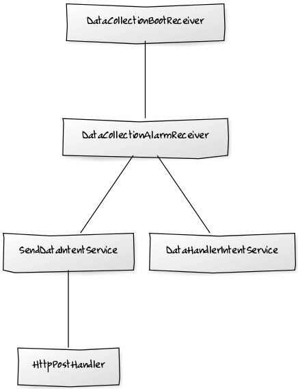

What is stored on a mobile device (fall 2014) - documentation
=============================================================

Deployment instructions
-----------------------

### System definition

The backend is a virtual server on University's network running Ubuntu 14.04. It has PostgreSQL and Ruby installed from PPA's, and Nginx and Supervisor from the official repositories. The ruby depedencies have been installed using bundler with the `bundle install --path vendor/bundle` command. The source code is located at `/home/tkt_pdp/app/`.

Nginx is configured to listen on port 80 and to act as a reverse proxy for the application. It has been configured with:

```
server {
  listen 80;
  server_name pdp.cs.helsinki.fi;
  root /home/tkt_pdp/app;

  location / {
    proxy_pass http://0.0.0.0:3000;
    proxy_set_header Host $host;
    proxy_set_header X-Forwarded-For $proxy_add_x_forwarded_for;
  }
}
```

Application is managed using Supervisor. It takes care of starting stopping and making sure the app stays up. This was accomplished by adding following lines to supervisord.conf:

```
[program:rails]
environment=RAILS_ENV=production
command=bundle exec rails s --binding 127.0.0.1
directory=/home/tkt_pdp/app/
user=tkt_pdp
```

The program can be managed using supervisorctl. The server can be started with:

```
# supervisorctl start rails
```

and stopped with:

```
# supervisorctl stop rails
```

Logs can be viewed using:

```
# supervisorctl tail rails
```

or if you want to follow them:

```
# supervisorctl tail -f rails
```

### Getting the latest code from repo

```
$ sudo su
# supervisorctl stop rails
# su tkt_pdp
$ cd /home/tkt_pdp/app/
$ git pull
$ bundle install
$ bundle exec rake db:migrate
$ bundle exec rake assets:precompile
$ exit
# supervisorctl start rails
```

### Creating and deleting a user for the backend

To create a user:

```
$ sudo su
# su tkt_pdp
$ cd /home/tkt_pdp/app/
$ bundle exec rails c
> User.create username:"usernamehere", password:"passwordhere", password_confirmation:"passwordhere"
```

To delete a user:

```
$ sudo su
# su tkt_pdp
$ cd /home/tkt_pdp/app/
$ bundle exec rails c
> u = User.find_by username:"usernamehere"
> u.destroy
```

The password must be at least 8 characters long. The Ruby on Rails application uses the "Devise" gem to handle user accounts.

Architecture
------------

### Android

The Android application consists of two main parts, the UI and background data collection.

#### UI

The UI consists of the parts that the user can interact with, such as settings and graphs. If the user opens the application for the first time, a one time questionnaire is presented to the user. Answering the questions is optional, and they provide basic information about the user such as gender, age, and email. These answers can be changed later on in the Settings menu. On the MainScreen the user can select to collect and send data, or to open the Graphs page. From the context menu on the top of the screen the user can open Settings or the About page.


#### Background data collection

The background data collection automatically collects data and sends it to the research server. It can be disabled from the settings.



DataCollectionAlarmReceiver is responsible for starting the scheduled data collection. It is repeated either daily, weekly, or monthly depending on the setting selected by the user. Because the Android OS clears all scheduled tasks on shutdown, the DataCollectionBootReceiver starts it again with the DataCollectionAlarmReceiver when the system starts up (if the user has enabled data collection and sending). At the moment, the sending time is counted from the system startup rather than from a certain specific time and date in order to avoid clogging the server with requests. After starting the scheduled sending, the first collection is started after a five minute delay.

DataHandlerIntentService is a service that collects the device data. Because the collection takes some time, it has its own thread. DataHandler collects all data by calling the getData() method of all the classes that implement the DataCollector interface. The database_utilities package has the necessary classes for saving the collected data on the devices local SQLite database as described in the offical [Android guide](https://developer.android.com/training/basics/data-storage/databases.html).

SendDataIntentService is responsible for sending the collected data to the server when a network connection is acquired. It uses HttpPostHandler to send an HTTP POST request containing the data in JSON format. JSONPackager creates a valid JSON object from the data on the local SQLite database. UniqueIdentifier creates a unique id for the mobile device that will anonymously associate the collected data with the specific mobile device on the backend.

### Back end

The backend is a Ruby on Rails server. Each mobile device that sends data is a unique "Subject" in the database. A "Collection" is a single set of data collected from a subject. A Subject can have multiple collections. A collection contains "Application", "Image", "Audio", "Video" and "Text" data of the Subjects mobile device. "Email" is a list of emails of participating people that have entered their emails on their mobile devices and shared data with the server. "User" list contains the user credentials for researchers.


Testing
-------

### Android

The Android application has unit tests for settings and the different data collectors, using Mockito for object mocking, and the Robotium library for mimicking user interactions. There are also integration tests (made with Calabash) for common use cases. Tests were run on several different devices and emulators. The application was also tested manually with devices ranging from 4.3 inch phones to 10.5 inch tablets, with Android versions 4.1.2, 4.4.2, 4.4.4 and 5.0. Background data sending was tested by leaving the test device on with network connectivity for several days. The stability of the user interface was tested manually aswell.

Unit tests can be run with:

```
$ ./gradlew connectedCheck --info
```

Calabash tests can be run with:

```
$ ./gradlew build
$ calabash-android resign app/build/outputs/apk/app-release-unsigned.apk
$ calabash-android run app/build/outputs/apk/app-release-unsigned.apk
```

### Back end

The backend rails server has automated tests. Unit and feature tests are handled by Rspec and integration tests by Cucumber. Factory Girl is used to create minimum valid objects for our tests.

Running unit tests:

```
$ bundle exec rspec
```

Running integration tests:

```
$ bundle exec cucumber
```

Known problems
--------------

-	Sharing might not work
-	Changing data sending frequency does not come in to effect until the device restarts or data sending setting is checked and unchecked
-	If a POST request gets too large, the data sending fails
-	Device collects and sends data after system restart no matter what the data sending frequency option is (only if data sending is enabled)
